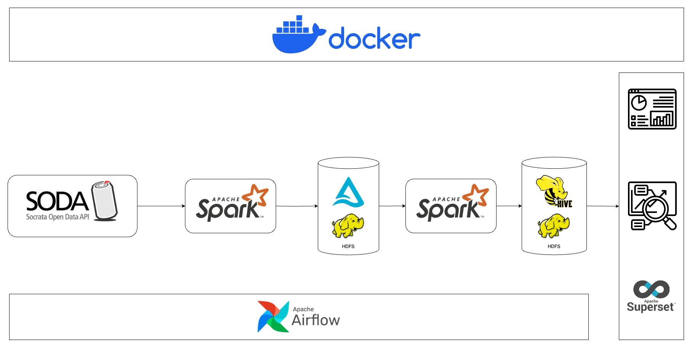
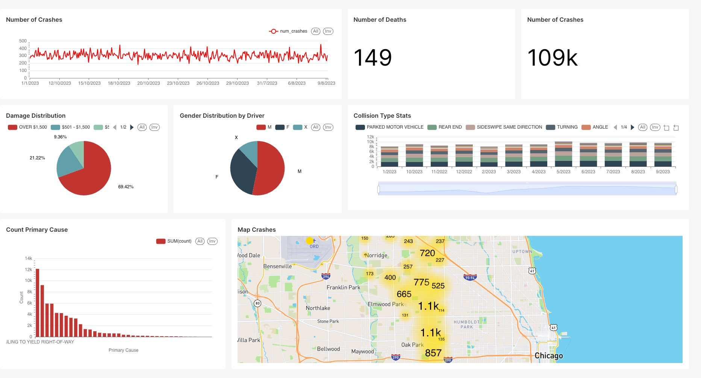

# Chicago Crashes Data Modeling
## Overview
This project aims to process data crawled from Soda API related to crashes happended in Chicago and conduct analysis from processed data.

## **Tools & Technology**
- Hadoop
- Docker
- Apache Spark
- Delta Lake
- Apache Hive
- Apache Airflow
- Apache Superset
- Language: Python

## Data Architecture


The project was built by multiple services deployed by Docker. Spark was used to ingest data to Data Lakehouse managed by delta lake hosted on HDFS and transform raw data to star schema stored in Data Warehouse used for data analysis. Superset was used for data visualization and data analysis. Finally, airflow was used to manage and schedule processing workflow happening in this project.

## Data Model

The image below is visualized result star schema:


This star schema use Mini Dimension to manage rapidly change dimension such as condition of traffic control divice and road condition. Bridge table was used to manage dimensions that have M:N relationship with fact table such as Vehicle Dimension or Person Dimension.

This data model can be used to answer against these questions:
* How many crashes happened in different granularity hour, day, month, week, year, day of week?
* How many fatal injuries in crashes in different granularity hour, day, month, week, year, day of week?
* What is the distribution of driver who cause crashes based on gender?
* What is the most primary cause of crashes?
* How many crashes happened in different weather condition?
* Damage distribution of crashes?
* What is the most collision type in crashes?
* etc.

## Example
The example visualization from data warehouse after transform from raw data:



## **Setup & Deployment**

### Prerequisites
- Docker

### Setup
I prepared few scripts to setup and start the project automatically. In order to setup this project, the following steps are required for the project to be successfully executed.

* Firstly, you need to gain permission for shell scripts by using the following command:
    ```
    chmod +x *.sh
    ```

* Then run the following command to setup required images and containers:
    ```
    ./setup.sh
    ```
    This function is downloading/buidling required images, then creating containers for services used in this project. </br>
    
* In order to start crawling and processing data, use this script:
    ```
    ./trigger-airflow.sh
    ```
    This script start crawling data from socrata API, storing data into HDFS as format of delta table and transforming data to star schema which would be stored at data warehouse.

* To shut down the project, use this command:
    ```
    ./shutdown.sh
    ```

* Running services can be directly accessible at following these sites:
    * Spark Web UI: http://localhost:8080
    * HDFS Web UI: http://localhost:9870 (You can observe crawled data in this directory /data/{table} on HDFS and transformed data in: spark-warehouse/{table})
    * Superset WebUI: http://localhost:8089
